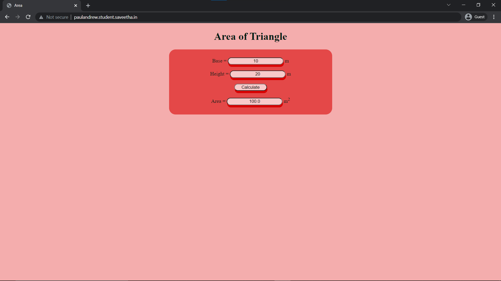

# Design a Website for Server Side Processing

## AIM:
To design a website to perform mathematical calculations in server side.

## DESIGN STEPS:
### Step 1:
Create a django project inside the pulled GitHub Repo.

### Step 2:
Insdie the project create a app called mathapp using command "sudo python3 manage.py startapp mathapp".

### Step 3:
Create a template folder inside mathapp and inside than create another folder called mathapp and inside that create a new file "area.html"

### Step 4:
Add the html conents in the area.html.

### Step 5:
Do the mathemical calculation in views.py and link the html tags.

### Step 6:
Link the html file through views.py in urls.py.

### Step 7:
Add mathapp to installed apps in setting.py and add necessary changes.

### Step 8:
Publish the website in the URL : http://paulandrew.student.saveetha.in.

## PROGRAM :
### HTML:
```
<!DOCTYPE html>
<html>
<head>
    <meta charset='utf-8'>
    <meta http-equiv='X-UA-Compatible' content='IE=edge'>
    <title>Area</title>
    <meta name='viewport' content='width=device-width, initial-scale=1'>
    <link rel='stylesheet' href="./style.css">
</head>
<body style="text-align: center;background-color: #f4adad;color: #081c15;">
    <!--Hi there-->
    <h1>Area of Triangle</h1>
    <div style="display: block; background-color: #e44848;text-align: center;border-radius: 20px;width: 500px; height: 200px; margin-left: auto; margin-right: auto;">
        <form method="POST" style="padding-top: 25px;">
            
            Base = <input type="text" name="base" value="{{b}}" style="text-align: center;border-radius: 20px;text-align: center;box-shadow: 1.5px 7px #d80000;background-color: #f8caca;" > m <br/>
            <br/>
            Height = <input type="text" name="height" value="{{h}}" style="text-align: center;border-radius: 20px;text-align: center;box-shadow: 1.5px 7px #d80000;background-color: #f8caca;"> m <br/>
            <br/>
            <input type="submit" value="Calculate" style="text-align: center; width: 100px;border-radius: 20px;text-align: center;box-shadow: 1.5px 7px #d80000;background-color: #f8caca;" ><br/>
            <br/>
            Area = <input type="text" name="area" value="{{area}}"style="text-align: center;border-radius: 20px;text-align: center;box-shadow: 1.5px 7px #d80000;background-color: #f8caca;"> m<sup>2 </sup><br/>
        </form>
    </div>
</body>
</html>
```
### views.py:
```
from django.shortcuts import render

# Create your views here.
def areacalculation(request):
    context = {}
    context["area"] = "0"
    context["b"] = "0"
    context["h"] = "0"
    if request.method == "POST":
        b = request.POST.get("base","0")
        h = request.POST.get("height","0")
        area = ((int(b) * int(h))/2)
        context["area"] = area
        context["b"] = b
        context["h"] = h
    return render(request,"mathapp/area.html",context)
```
### urls.py:
```
"""calculation URL Configuration

The `urlpatterns` list routes URLs to views. For more information please see:
    https://docs.djangoproject.com/en/3.1/topics/http/urls/
Examples:
Function views
    1. Add an import:  from my_app import views
    2. Add a URL to urlpatterns:  path('', views.home, name='home')
Class-based views
    1. Add an import:  from other_app.views import Home
    2. Add a URL to urlpatterns:  path('', Home.as_view(), name='home')
Including another URLconf
    1. Import the include() function: from django.urls import include, path
    2. Add a URL to urlpatterns:  path('blog/', include('blog.urls'))
"""
from django.contrib import admin
from django.urls import path
from mathapp import views

urlpatterns = [
    path('admin/', admin.site.urls),
    path("areaofrectangle/",views.areacalculation,name="areaofrectangle"),
    #The below line is to display the html page on our site without /staic/areaofreactangle.
    path("",views.areacalculation,name="areaofrectangleroot")
]

```
## OUTPUT:
### Before Calculation:

### After Calculation:

## Result:
Thus a website is designed to perform mathematical calculations in server side and is hosted at http://paulandrew.student.saveetha.in.